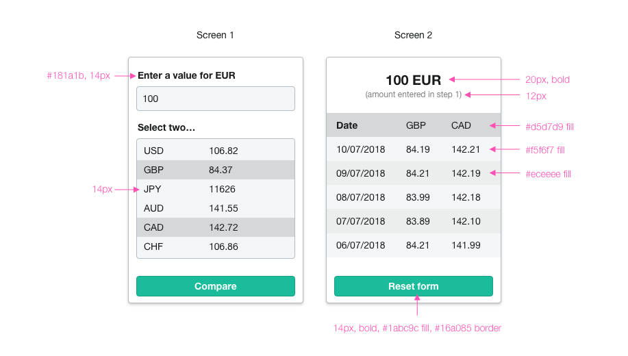

# Code challenge instructions
Your challenge for today is to provide an interactive web interface for comparing Foreign Exchange rates.

## Getting started
The application uses a simple Node/express server to run locally.

1. run `npm i` to install dependencies.
2. run `npm start` to start the server.

## Interface
Create an accessible, responsive and modern user interface to fetch and display the exchange rates for the current date.

### Here's how your app might look:

* Changing the base currency (EUR) amount re-calculates the exchange amounts for the listed currencies.

* The currency rows are selectable. On selection of two rows, it renders a table with the exchange rates of the selected currencies over the last 5 days.

### Design and presentation
Try to keep your CSS lightweight and free of unnecessary bloat.

We would like to see a modular, scalable, conventional approach oriented towards reusable code.

We’d like the user interface to be responsive so that it works across different resolutions and devices.

## Data Source
During development, the data source of FX rates will be the [Fixer API](​http://fixer.io​), you will need to sign up for a free account. For this exercise, let's restrict the currencies to the following set:

*USD, EUR, GBP, AUD, CAD, CHF, CNY, SEK, NZD.*

All exchange rates should use **EUR** as a base currency.

In the template provided you can add your API key to `server.js`

**Note**: Using the free version of Fixer will mean calling the API multiple times for historical data. This is fine for this exercise.

## Solution Requirements
Your solution should be written in JavaScript. You can use the framework provided or feel free to use your preferred set of libraries, tools, modules. At FreeAgent we use: ES6, Stimulus, React, SCSS, Rails and Ruby, however we want you to use the technology you're comfortable with.
