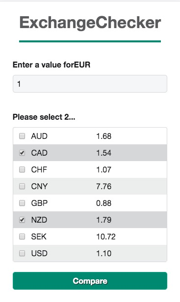

# FreeAgent Coding Challenge

---

## Your Solution Setup and Run Instructions

On localhost:

1. Add an .env file at the root level with the following variables:
   `FIXER_KEY=<your-key>`
   `FIXER_URL=http://data.fixer.io/api/`

- a free Fixer key is available from https://fixer.io/

2. From the command line:
   `npm install`
   `npm run build`

- This launches the client and server simultaneously
- The app is available on `localhost:3000`

## Your Design Decisions

### Architecture:

- Currencies determined by client rather than server endpoint, to allow for flexibility
- Page-based architecture to allow for persistent navbar/footer and rerendering of <main> e.g. through react-router
- Page-level data retrieval (rather than top-level/app) to allow for different types of api call elsewhere if app extended

### Tech choices

- React for automatic updates to DOM
- Node async to combine results from history api: https://caolan.github.io/async/v3/
- Webpack & Babel for cross-browser compatibility/code optimization. Set up from scratch rather than via create-react-app to allow for customisability
- SCSS for variables with better browser support than CSS variables
- 7-in-1 SCSS organisation
- `axios` for easier error handling and better browser support than fetch (using promise chaining rather than try/catch block with async/await, as find it easier to read in this case!)
- `react-debounce-input`
- `prop-types` for basic type checking
- Jest & React Testing Library for testing (more focus on user behaviour)

### Accessibility

- Green colour on wireframe failed accessibility checks as insufficient contrast. Replaced with a darker colour, but this could be reversed (https://webaim.org/resources/contrastchecker/)!
- Checkboxes rather than multiple select as more accessible https://webaim.org/techniques/forms/controls#checkbox
- Checkboxes left as visible to enable tabbing through: using Tab for forwards, Tab+Shift for backwards and space bar to select
- Hiding the checkboxes to match the wireframe would prevent this (if appearance is crucial, then checkboxes can be set to opacity 0)
- Lighthouse score of 100
- Semantic HTMl used wherever possible, aria attributes where needed (table rows/columns, inputs, errors)

## Improvements:

- Form validation needs to be improved - errors could be 'inline'. Would need to be accessible too (aria-invalid).
- Server code could be organised into separate files (routes/controllers etc.)
- More comprehensive tests could be added: currently minimal at 68% coverage for React & missing Express/Node testing completely
- Add a cache to the backend to prevent unnecessary repeat requests to Fixer.io
- Smoother transitions via animations

