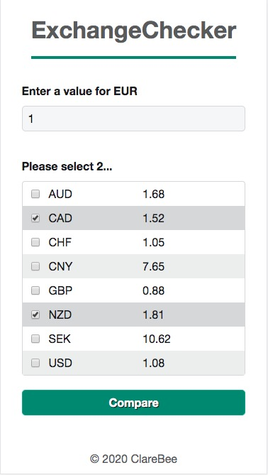
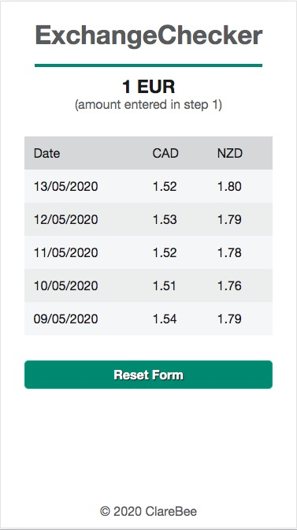

# Currency Checker
- Choose 2 currencies to compare a 5-day history with the Euro, using the Fixer API.
- React frontend backed by Express.js.
- Features: React setup with Webpack and Babel, Accessible UI, Express, Async Node for bundled api requests, SCSS, Jest and React Testing Library

## To Run

On localhost:

1. Add an .env file at the root level with the following variables (or pass in variables on the command line):
   `FIXER_KEY=<your-key>`
   `FIXER_URL=http://data.fixer.io/api/`

- a free Fixer key is available from https://fixer.io/

2. From the command line:
   `npm install`
   `npm run build`

- This launches the client and server simultaneously
- The app is available on `localhost:3000`

## Improvements:

- Form validation needs to be improved - errors could be 'inline'. Would need to be accessible too (aria-invalid).
- Server code could be organised into separate files (routes/controllers etc.)
- More comprehensive tests could be added: currently minimal at 72% coverage for React & missing Express/Node testing completely
- Add a cache to the backend to prevent unnecessary repeat requests to Fixer.io
- Smoother transitions via animations

